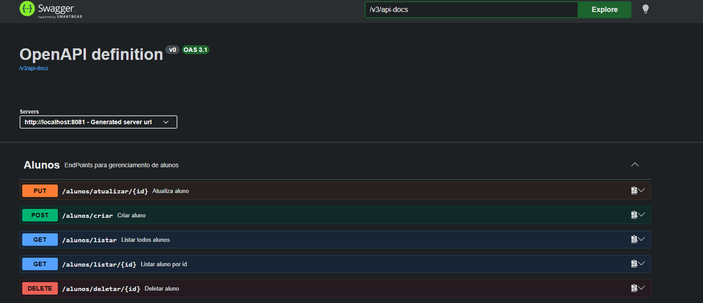
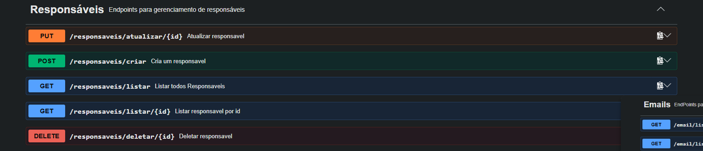
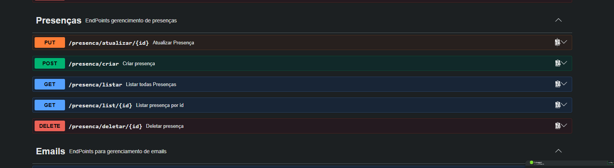
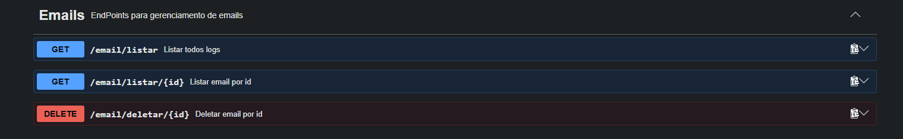
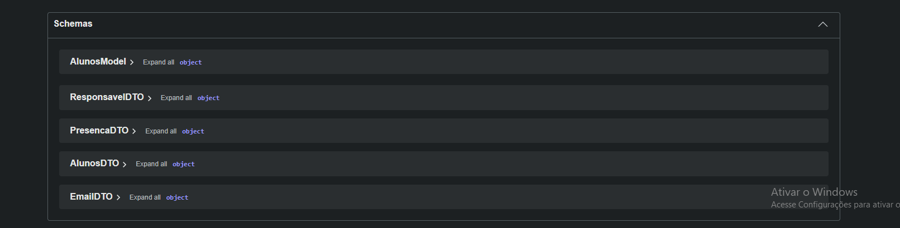

# checkAluno 🎓

API REST desenvolvida em **Java + Spring Boot** para controle de presença escolar, com **notificação automática por e-mail** aos responsáveis sempre que um aluno registra falta.

Projeto construído para praticar arquitetura em camadas, modelagem de relacionamentos com JPA, validação de dados, testes automatizados e containerização com Docker.

---

## ✨ Funcionalidades

- 👨‍👩‍👧 Cadastro de **Responsáveis** (pais/tutores)
- 🎓 Cadastro de **Alunos**, vinculados a um responsável
- ✅ Registro de **Presença/Falta** por aluno
- 📧 **Envio automático de e-mail** ao responsável quando o aluno falta, com log de auditoria de todos os envios
- 📚 Documentação interativa da API via **Swagger UI**
- 🐳 Aplicação **containerizada** com Docker Compose (API + PostgreSQL)

---

## 📸 Swagger UI

<p align="center">
  
</p>
<p align="center">
  
</p>
<p align="center">
  
</p>
<p align="center">
  
</p>
<p align="center">
  
</p>

---

## 🛠️ Stack Tecnológica

| Tecnologia | Uso |
|---|---|
| Java 17 | Linguagem |
| Spring Boot | Framework principal |
| Spring Data JPA / Hibernate | Persistência de dados |
| PostgreSQL | Banco de dados |
| Spring Mail | Envio de e-mails (SMTP) |
| Bean Validation (Jakarta Validation) | Validação dos dados de entrada |
| JUnit 5 + Mockito | Testes automatizados |
| H2 (em memória) | Banco usado durante os testes |
| springdoc-openapi (Swagger UI) | Documentação interativa da API |
| Docker / Docker Compose | Containerização e orquestração local |
| Lombok | Redução de boilerplate |
| Maven | Gerenciador de build/dependências |

---

## 🏗️ Arquitetura

O projeto segue uma arquitetura em camadas organizada **por módulo de domínio** ("package by feature"):

```
Controller  →  Service  →  Repository  →  Model (entidade JPA)
```

Os dados trafegam entre API e cliente sempre como **DTO**, convertidos por um **Mapper** dedicado — a entidade JPA nunca é exposta diretamente na resposta da API.

```
src/main/java/com/br/checkAluno/
├── Alunos/          # Cadastro de alunos
├── Responsaveis/    # Cadastro de responsáveis
├── Presencas/       # Registro de presença/falta
└── Email/           # Envio e log de e-mails
```

### Modelo de domínio

```
Responsavel (1) ──────< (N) Aluno (1) ──────< (N) Presenca
```

- Um **Responsável** pode ter vários **Alunos**.
- Um **Aluno** pertence a um único **Responsável** e possui várias **Presenças**.
- **Email** funciona como log independente de todos os envios feitos pelo sistema.

---

## ✅ Validação de Dados

Todos os DTOs de entrada usam **Bean Validation**, com `@Valid` aplicado em cada endpoint que recebe dados:

- Campos obrigatórios (`@NotBlank`, `@NotNull`)
- Validação de CPF com dígito verificador (`@CPF`)
- Validação de formato de e-mail (`@Email`)
- Mensagens de erro customizadas por campo

Quando a validação falha, a API responde `400 Bad Request` automaticamente, antes mesmo de qualquer regra de negócio ser executada.

---

## 📧 Regra de Negócio: Notificação por E-mail

Fluxo executado ao registrar uma presença:

1. Recebe o registro de presença (`status = true` para presente, `false` para falta).
2. Valida se o aluno existe.
3. Salva o registro.
4. **Se for uma falta**, busca o e-mail do responsável do aluno e dispara um e-mail automático avisando da ausência — o resultado do envio (sucesso ou erro) é registrado em log no banco.

---

## 🐳 Imagem no Docker Hub

A imagem da API também está publicada no Docker Hub e pode ser baixada diretamente:

```bash
docker pull joaopaulo951/api-check-aluno
```

🔗 [joaopaulo951/api-check-aluno](https://hub.docker.com/r/joaopaulo951/api-check-aluno)

---

## 🐳 Como Executar com Docker (recomendado)

**Pré-requisito:** Docker e Docker Compose instalados.

```bash
# 1. Gerar o .jar da aplicação
./mvnw clean package -DskipTests

# 2. Subir a API + banco PostgreSQL juntos
docker compose up --build
```

A aplicação sobe em `http://localhost:8081`, já conectada ao banco PostgreSQL rodando em outro container.

**Variáveis de ambiente** usadas pelos containers (definidas no `docker-compose.yml`):

```yaml
DATABASE_URL: jdbc:postgresql://postgres:5432/seu_banco
DATABASE_USERNAME: postgres
DATABASE_PASSWORD: sua_senha
MAIL_HOST: smtp.exemplo.com
MAIL_PORT: 587
MAIL_USERNAME: seu-email@exemplo.com
MAIL_PASSWORD: sua-senha
```

> Substitua os valores de e-mail pelas credenciais reais de um servidor SMTP (ex: Mailtrap para testes) para o envio de e-mails funcionar de fato.

---

## 🚀 Como Executar sem Docker

**Pré-requisitos:** Java 17, PostgreSQL, Maven (ou o wrapper `mvnw` incluso).

1. Crie um arquivo `.env` na raiz do projeto com base no `.env.example` (veja abaixo).
2. Rode com o wrapper do Maven:

```bash
./mvnw spring-boot:run
```

A aplicação sobe em `http://localhost:8081`.

**Swagger UI:**
```
http://localhost:8081/swagger-ui/index.html
```

### Variáveis de ambiente (`.env.example`)

```env
DATABASE_URL=jdbc:postgresql://localhost:5432/postgres
DATABASE_USERNAME=
DATABASE_PASSWORD=

MAIL_HOST=
MAIL_PORT=
MAIL_USERNAME=
MAIL_PASSWORD=
```

> O `.env` real nunca deve ser commitado — já está listado no `.gitignore`.

---

## 📌 Endpoints Principais

| Recurso | Rota base | Métodos |
|---|---|---|
| Alunos | `/alunos` | listar, listar por id, criar, atualizar, deletar |
| Responsáveis | `/responsaveis` | listar, listar por id, criar, atualizar, deletar |
| Presenças | `/presenca` | listar, listar por id, criar, atualizar, deletar |
| Emails (log) | `/email` | listar, listar por id, deletar |

Documentação completa e testável de cada rota disponível via Swagger UI.

---

## 🧪 Testes

Testes unitários (JUnit 5 + Mockito) cobrindo os principais serviços da aplicação, além de um teste de integração que sobe o contexto completo do Spring contra um banco H2 em memória:

```bash
./mvnw test
```

---

## 🗺️ Próximos Passos

Roadmap de evolução planejado para o projeto:

- [ ] Tratamento de exceções centralizado (`@ControllerAdvice`), padronizando o formato de erro da API
- [ ] Autenticação e autorização (Spring Security)
- [ ] Migrations versionadas com Flyway, em vez de `ddl-auto=update`
- [ ] DTOs de referência (id-only) para relacionamentos entre entidades, reduzindo o acoplamento entre entidade JPA e contrato de API
- [ ] Deploy em nuvem (AWS)

---

## 👤 Autor

Projeto desenvolvido como prática de arquitetura backend com Spring Boot, Docker e boas práticas de API REST.
